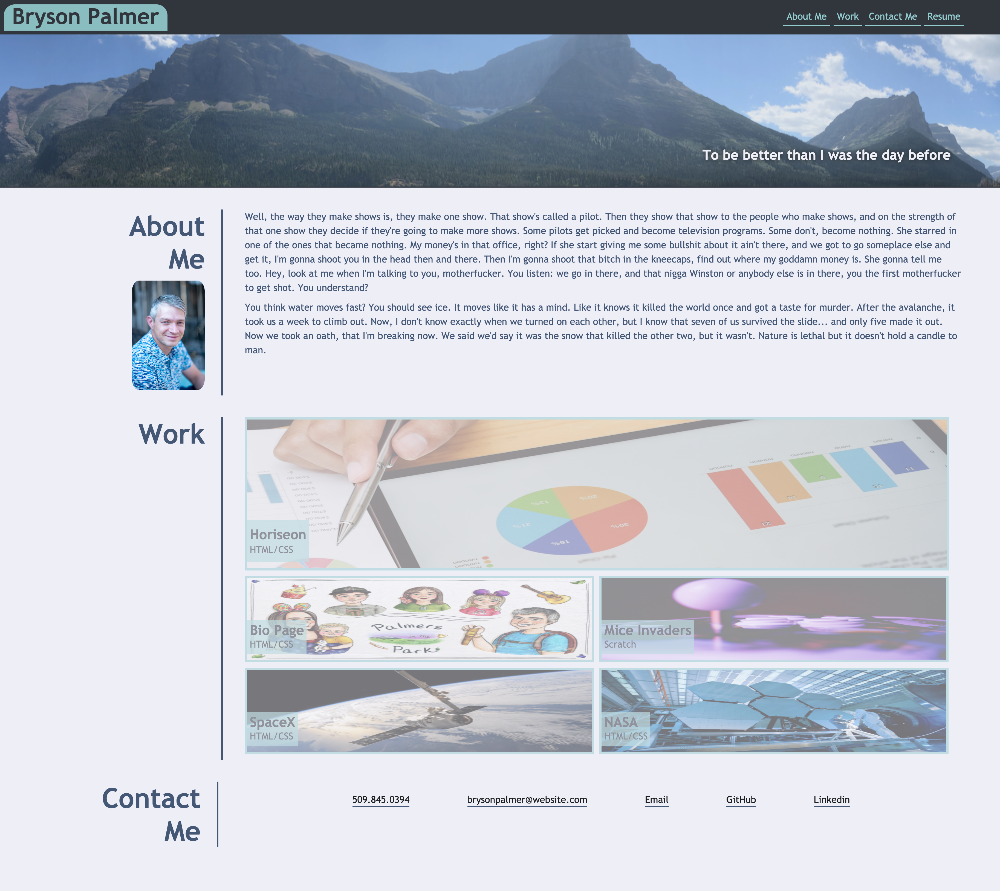
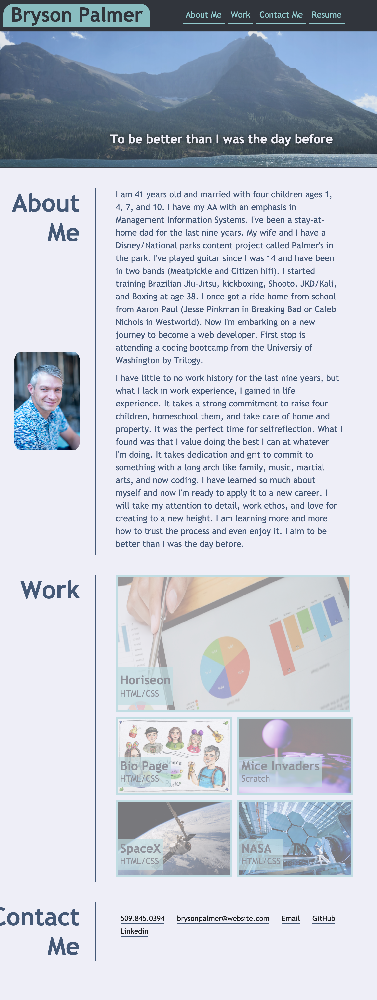
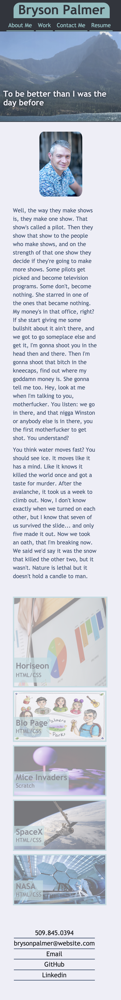

## 
# Welcome to my Portfolio
## Bryson Palmer - Student Jr Web Developer
I am currently a bootcamp *full stack* web developer student through the *University of Washington* under *Trilogy Education Services*. I'm looking to get into web development for my professional work. I plan on being a capable, creative, team oriented developer by the end of this program. I look forward to implementing this new skill in future employment. 

Goal:  
To give a potential employer work samples from my deployed portfolio. I built a web portfolio page from scratch that I can add to as the course of this bootcamp progresses. 

## Page Navigation Links
[Acceptance Criteria](acceptance-criteria)  
[In Addition](#in-addition)  
[Links to Git Hub and Live url](#links)  
[Full Screenshot](#screenshot-of-full-screen)  
[iPad Screenshot](#screenshot-of-ipad-screen)  
[iPhone Screenshot](#screenshot-of-iphone)  
[Issues to Address in the Future](#issues-to-address-in-the-future)  
[Other Information](#other-information)  

##  💼 Acceptance Criteria
* When the portfolio is loaded my name, a recent photo, and links to sections about me, my work, and how to contact me are presented.
* When navigation links are clicked, the UI scrolls to the corresponding section.
* When the work link is clicked, the UI scrolls to a section with titled images of my applications.
* When presented with my first applicatin, the image will be larger in size than the images of my other applications.
* When the images of the applications are clicked on, the user will be taken to that deployed application. 
* When the page is resized or viewed from various screens and devices, the layout is responsive that adapts to the viewport. 

- [✔️] **Status Complete**

##  🏆 In Addition 
* Added meta data to aid in *search engine optimization* by adding a description and keywords to the head of the code.
* Added meta data to set the *viewport* to make website look good on all devices.
* Included *comments* throughout the **HTML** and **CSS** code to label and/or explain about function.

- [✔️] **Status Complete**  
 
__________________________

##  Links

Link to **repository** on **Git Hub** - [https://github.com/Bryson-Palmer/Portfolio.git](https://github.com/Bryson-Palmer/Portfolio.git)

Live **URL** link to **my portfolio** - [https://bryson-palmer.github.io/Portfolio/](https://bryson-palmer.github.io/Portfolio/)
 
__________________________

## 📸  Screenshot of full screen

## 📸  Screenshot of iPad screen

 

## 📸  Screenshot of iPhone X

 

##  🔍 Issues to Address in the Future
Utilize **JavaScript** to give my portfolio a truly interactive user experience.

##  📡 Other Information
* Installation: none
* Usage: A personal portfolio for potential employers to get a feel for who I am and what I can do.
* Credits: I would like to credit my teacher and TAs for their help and support, W3Schools and Web MD for their well organized information regarding responsive web layouts, and the contributers to pexels.com for their free to use images (bongkarn thanyakij, George Becker, SpaceX, and Pixabay). Lastly, I would like to credit A Bit Of Miranda for the illustration of my family.
* License: No license at this time.

[Back to Top](#back-to-top)  